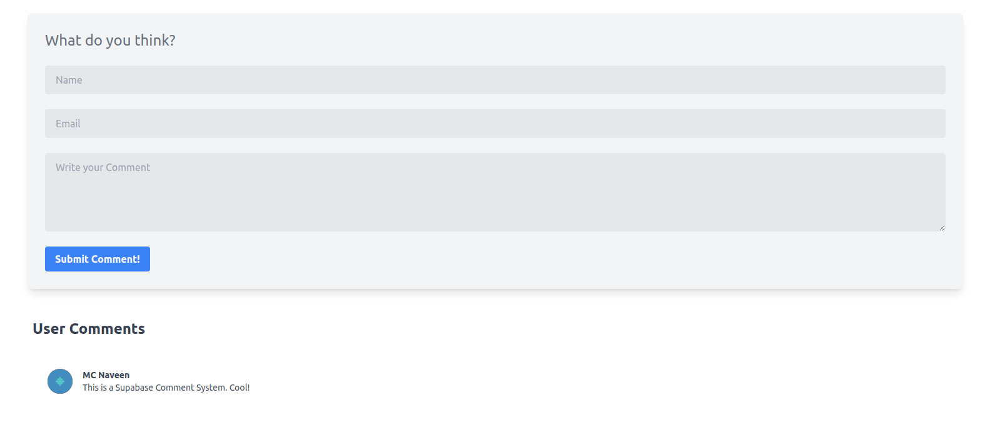

## SupaComments 


> :zap: A blazing fast, lightweight, and open source comment system for your static website, blogs


### :rocket: Demo

You can visit the Below demo blog post to see the SupaComments in action.

> [https://supacomments.netlify.app/abc/](https://supacomments.netlify.app/abc/)

### :magic_wand: Lightweight

SupaComments js bundle is less than 25kb and CSS bundle is less than 5kb.


### :package: Requirements

```
Static Blog or Website
```

### :sparkles: Installation and Usage

- Clone the Repo

```
git clone https://github.com/mcnaveen/supacomments.git
```

- cd into the directory

```
cd supacomments
```

- Install dependencies

```
yarn install
```

- Configure the environment variables

```
cp .env.example .env
```

- In the [Supabase Dashboard](https://app.supabase.io) create a new project and database.
- Table name should be: `comments`
- Make sure you have the same table structure like below.

```sql
id - int8
name - text
email - text
postURL - text
comment - text
created_at - timestamp
show - boolean
```

- Default value for `show` should be `true`


- Copy API URL and Key ([Supabase Guide for Creating API URL and Key](https://supabase.com/docs/guides/api#api-url-and-keys))
- Now open the `.env` and change the values copied from the above step
- Change the Hostname to your domain name without http:// or https:// and trailing slash

> ### Example
>
> ```
> SUPACOMMENT_HOST_URL=supabase.com
> SUPACOMMENT_SUPABASE_URL=https://xxxxxxxxxxxx.supabase.co
> SUPACOMMENT_SUPABASE_ANON_KEY=xxxxxxxxxxxxxxxxx
> ```

Once you have the environment variables set, run the following command to start the build process.

```
yarn build
```

- This will create a `comments.js` & `comments.css` files under the `pubic/build` directory.

- Copy and paste the two files to root of your static website or blog.

### :pen: Usage

- To import the `comments.js` & `comments.css` file, paste the below code before `</head>` closing tag.

```html
<script src="./comments.js">
<link rel="stylesheet" href="./comments.css" />
```

- Then, paste the Below code where you want to show the comments.

```html
<div id='comments'></div>
```

Now, If you open your static website or blog, you will see the comments section like below.



### :white_check_mark: TODO/Features

- [x] Ability to add comment section based on div element
- [ ] Click to load user's comments
- [ ] Add native styling instead of Tailwind CSS
- [ ] Add Docker support
- [ ] Add Reply to comment feature
- [ ] Add ability to edit and delete comment
- [ ] Add ability to add comment as logged in user or anonymous user
- [ ] Add Admin Panel for managing comments (As Monorepo)

> These are the planned features, if you have any feature request, please open an feature request on [Github](https://github.com/mcnaveen/SupaComments/issues/new?assignees=&labels=&template=feature_request.md&title=)

### :books: Contributions
Checkout the [Contributing Guide](CONTRIBUTION.md)
### Breaking Changes
:warning: Use it with caution, Breaking changes ahead!

### Disclaimer

You can add features and fixes but please don't claim this project as your own.

### :pray: Additional Information

This project uses [Supabase](https://supabase.com) for the database, [Svelte](https://svelte.dev/) for the frontend and [Tailwind CSS](https://tailwindcss.com/) for the styling and Demo is built with [Gatsby MDX Starter](https://github.com/mcnaveen/gatsby-mdx-starter-blog).


### :green_heart: Message

I hope you find this project useful. If you have any questions, please create an issue.


### License

Copyright (c) 2022 [SupaComments](LICENSE)